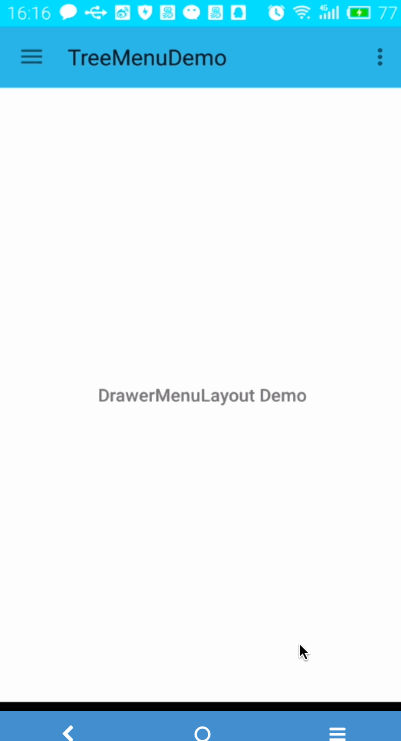

TreeMenu
=================
Tree menu is commonly designed in Apps. This Android library makes it very easy to create tree menus in an Android APP . You need not write xml files any more to create tree menus By using **TreeMenu**. You can easily create a three-layer tree menu at most with this library. Each menu item created has a left image, a title, a right image and can be expanded or collpased when there are sub menus belong it.  

Here is a short gif showing the demo written with this library:  
 


Goal
----
When i use DrawerLayout in App, if there is a menu list in Navigation part , I always should write xml file like this:  
```XML
<android.support.v4.widget.DrawerLayout
xmlns:android="http://schemas.android.com/apk/res ... />  
	<FrameLayout .../>  
	<!-- as menu list -->
    <ListView .../>
</android.support.v4.widget.DrawerLayout>
```  
or like this:  

```XML
<android.support.v4.widget.DrawerLayout
xmlns:android="http://schemas.android.com/apk/res ... />  
	<FrameLayout .../>  
    <LinearLayout
		... >
		<!-- write menu list here -->
    </LinearLayout>
</android.support.v4.widget.DrawerLayout>
```    
some one would think it's convient to use NavigationView (in Android Design Support Library), but it is not convient to create a tree menu which is two-layer or three-layer.  
Thus i want to write this library that can help you to create a two-layer or three-layer tree menu with minimal efforts and time, provides many very useful API.

Installing
----
###Cloning by Git  
Clone the library to local by typing command in terminal:   
```shell  
git clone https://github.com/MrBigBang/TreeMenu.git
```


How to use?
----
* Use in XML
	
	```XML
		<com.hyman.treemenu.DrawerMenuLayout
            android:id="@+id/drawerMenuLayout"
            android:layout_width="match_parent"
            android:layout_height="wrap_content"
            android:layout_marginTop="16dp"
            app:menuHeight="46dp"
            app:isDividerVisible="true"/>
	``` 
	 
	There some attributes can be used in XML:   
	`menuHeight` is used to define height of each menu item;  
	`isDividerVisible` is used to set visibility of dividers between two menu item,  
	`indent` set the submenu's indent relative the left of its father menu.		
	
* Create MenuView instance in code  
	```JAVA
		// create MenuViews
        UnExpandableMenu topMenu1 = new UnExpandableMenu(getContext());
        // by this way set tag to each MenuView
        topMenu1.setTag(MENU_ONE);
        UnExpandableMenu topMenu2 = new UnExpandableMenu(getContext());
        topMenu1.setTag(MENU_TWO);
        ExpandableMenu topMenu3 = new ExpandableMenu(getContext());
        UnExpandableMenu secMenu1 = new UnExpandableMenu(getContext());
        secMenu1.setTag(MENU_THREE);
        UnExpandableMenu secMenu2 = new UnExpandableMenu(getContext());
        secMenu2.setTag(MENU_FOUR);
        ExpandableMenu secMenu3 = new ExpandableMenu(getContext());
        UnExpandableMenu thirdMenu1 = new UnExpandableMenu(getContext());
        thirdMenu1.setTag(MENU_FIVE);
        UnExpandableMenu thirdMenu2 = new UnExpandableMenu(getContext());
        thirdMenu2.setTag(MENU_SIX);
        secMenu3.addSubMenus(2, thirdMenu1, thirdMenu2);
        topMenu3.addSubMenus(3, secMenu1, secMenu2, secMenu3);
        UnExpandableMenu topMenu4 = new UnExpandableMenu(getContext());
        topMenu4.setTag(MENU_SEVEN);
        DrawerMenuLayout drawerMenuLayout = new DrawerMenuLayout(getContext());
	```  
	If you create menu in this way , you can set the initial selected menu like this:    
	
	```JAVA    
	drawerMenuLayout.setInitialSelectedMenu(topMenu1)
	```
	
* Create Menu with POJO list  
	```JAVA  
		List<TopMenu> topMenuList = new LinkedList<>();
        TopMenu topMenu = new TopMenu("TreeMenu in ScrollView", item1Icon, null);
        topMenu.setTag(MENU_TREEMENU_IN_SCROLLVIEW);
        topMenuList.add(topMenu);
        TopMenu topMenu2 = new TopMenu("Init Selected Menu", item2Icon, null);
        topMenu2.setTag(MENU_INIT_SELECTED_MENU);
        topMenuList.add(topMenu2);
        TopMenu topMenu3 = new TopMenu("About Me", profileIcon, null);
        topMenu3.setTag(MENU_ABOUT_ME);
        topMenuList.add(topMenu3);
        drawerMenuLayout.createMenus(topMenuList);
	```
	
 In order to let user handle menu click event, there is a  interface `DrawerMenuLayout.OnMenuClickListener` which activity or fragment should implement.  
 ```JAVA
 drawerMenuLayout.setOnMenuClickListener(this);
 // or use an anonymous class
 ```

Contributing
----
This Library is new created, which may has a lot of bug and deficiencies. and my programming competence is limited. So every kand of contribution is welcomed.  

License
----
```
Copyright 2016 Hyman Lee  
 
 Licensed under the Apache License, Version 2.0 (the "License");
you may not use this file except in compliance with the License.
You may obtain a copy of the License at

   http://www.apache.org/licenses/LICENSE-2.0

Unless required by applicable law or agreed to in writing, software
distributed under the License is distributed on an "AS IS" BASIS,
WITHOUT WARRANTIES OR CONDITIONS OF ANY KIND, either express or implied.
See the License for the specific language governing permissions and
limitations under the License.
   
 If you've used this library in your app, please let me know it and tell me how it works, Thanks!  
 ```

